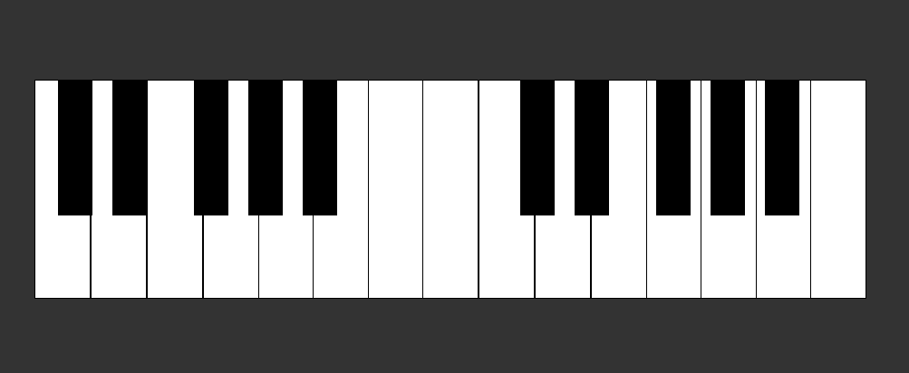

# Boceto de Piano Sonoro

## Descripción

Este proyecto es un pre-diseño de un piano sonoro, desarrollado como parte de una colaboración para el sitio web de **Music Coders**, una escuela de música en línea. El objetivo principal es proporcionar una herramienta interactiva para aprender sobre música y experimentar con sonidos, utilizando tecnologías web modernas.

## Características del Proyecto

- **Interacción**: El piano permite la interacción a través del mouse y el teclado de la computadora.
- **Oscilador**: Utiliza un oscilador de tipo `square` para generar el sonido de las notas.
- **Duración del Sonido**: Cada nota tiene una duración de 0.2 segundos.
- **Frecuencia de las Notas**: El sonido se genera mediante frecuencias específicas para cada nota.

## Tecnologías Utilizadas

- **HTML**: Estructura del piano.
- **CSS**: Estilización del piano para una presentación visual clara y atractiva.
- **JavaScript**: Lógica para la generación del sonido y la interacción del usuario.

## Funcionamiento

El piano está compuesto por teclas blancas y negras, representando las diferentes notas musicales. Al presionar una tecla, ya sea con el mouse o el teclado de la computadora, se genera un sonido correspondiente a la nota seleccionada.

Cada sonido es producido por un oscilador de tipo `square` en la API de Audio de Web, con una frecuencia específica que corresponde a la nota musical. El oscilador está configurado para reproducir el sonido durante 0.2 segundos.

## Objetivo del Proyecto

Este proyecto forma parte de una colaboración para el sitio web **Music Coders**, con el fin de proporcionar una herramienta educativa y divertida para los estudiantes de música en línea. El piano interactivo permite a los usuarios experimentar con diferentes notas y frecuencias, facilitando el aprendizaje de la música y la práctica de habilidades musicales.

## Contribuciones

Este proyecto de aprendizaje es un esfuerzo conjunto de la comunidad de **Music Coders** , alumnos-Factoría-F5.
07/2024

